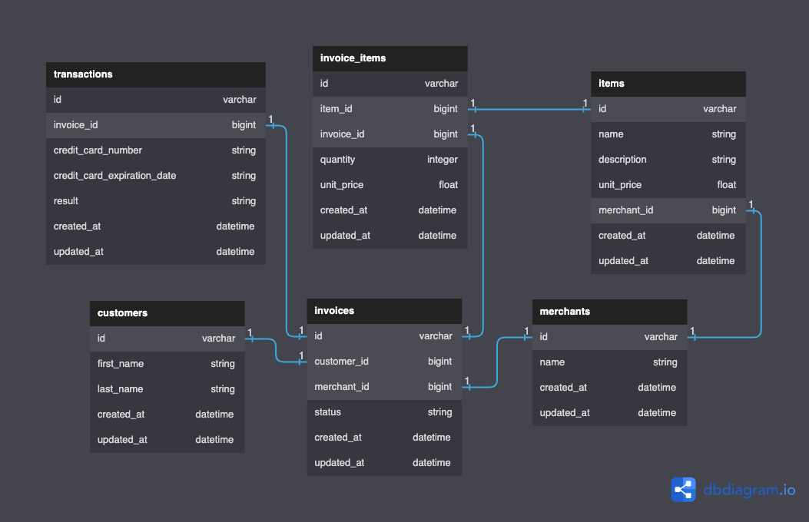

<!-- PROJECT LOGO -->
 

  

<h1 align="center">Rails-Engine</h1>

<!-- ABOUT THE PROJECT -->
## About The Project

Service API for a mock E-commerce application.

### Built With

* Ruby ~ 2.7.4
* Rails ~ 5.2.8

<!-- Phases -->
## Phases

[Turing Project Requirements](https://backend.turing.edu/module3/projects/rails_engine_lite/requirements)

- [x] RESTful Endpoints for merchants and items
- [x] Include CRUD functionality for items
- [x] Non-RESTful Endpoints for searching items and merchants
- [x] Include Sad-path testing for searches

<!-- CONTACT -->
## Contact

Joseph H. - Joseph.Hilby@gmail.com

<!-- ACKNOWLEDGMENTS -->
## Acknowledgments

* Turing School of Software Design: [https://turing.edu/](https://turing.edu/)

